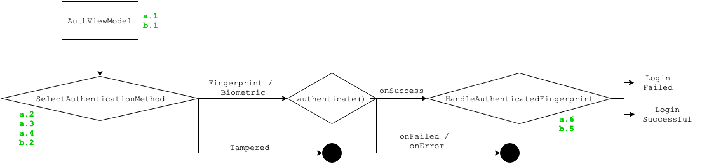

Fingerprint Authentication Flow [Android Specific]
----

## Introduction
The main goal of this study is to showcase the usage of fingerprint authentication in a password-based system considering it's security benefits. The app consists of a main login screen in which username and password are requested and the user is able to opt-in to fingerprint (biometric) authentication during the first login. If the user opt-in, subsequent app opens will automatically asks for user's fingerprint. Once authentication is completed, the user is moved to the next screen which shows a fake transaction.

### Considerations on App Authentication Flow
- Any username/password is accepted
- In case fingerprint is not opted-in during login, login will successfuly be made
- If fingerprint is not supported (see below), fallback method will be called. (Which is doing nothing but showing a tost so far :D)
- **The business rule of having the credentials authenticated is a simple successful write to `SharedPreferences`, which can be changed to whatever fits the business**
- Architecture was not a key point in this sample and there isn't much happening in brackground threads
- Some exceptions might not have been caught
- There are no tests for this sample project

### Considerations on used APIs (and SDK versions)
- Target API is set to 29 (Q Preview)
- Minimum API is set to 21 although Fingerprint support starts in 23
- If the app is running on API lower than 23, fallback method will be called (Which is doing nothing but showing a tost so far :D)
- From Android API 28+, Fingerprint API is deprecated in favor of BiometricPrompt API. The current approach in the app uses both (Fingerprint and BiometricPrompt) according to the current Android version on the device
- There is a [BiometricPromptCompat API](https://mvnrepository.com/artifact/androidx.biometric/biometric) (which is backward-compatible) which still in alpha.

### Fingerprint is supported when:
- (a) SDK version is 23+
- (b) Permission is granted (_USE_FINGERPRINT_ if SDK < 28 else _USE_BIOMETRIC_)
- (c) Hardware is present and ok
- (d) There is at least one fingerprint enrolled

Hardware and enrolled fingerprint validations have different APIs dependending on SDK version. I've used the following combinations:
- BiometricManager for `SDK >= 29`
- FingerprintManagerCompat for `SDK > 23`
- FingerprintManager for `SDK == 23`

## Authentication Flow

The overall process goes like this for a first login:
- (a.1) Check fingerprint support
- (a.2) Generate a Secret Key
- (a.3) Make it "fingerprint-protected"
- (a.4) Store in Android KeyStore
- (a.5) Request fingerprint authentication
- (a.6) Encrypt sensitive-data
- (a.7) Login

Subsequent logins follows like this:
- (b.1) Check fingerprint support
- (b.2) Request access to existing Secret Key in KeyStore
- (b.3) Request fingerprint authentication
- (b.4) Allow access to Secret Key
- (b.5) Decrypt sensitive-data
- (b.6) Login

Some of the steps above are laid out in the image to ease the identification in code:



- The `AuthViewModel` starts by checking fingerprint support through the `checks` dependency of `AuthViewModel`; 
- Then is find out which path to follow according to the current API by using the `SelectAuthenticationMethodUseCase`. It also manage cryptographic keys by creating a new one or using an existing one;
- Once done, it will request the fingerprint authentication, asking the user to touch the sensor;
- A callback will be called according to the result, if successful or not. In case it's valid, `HandleAuthenticatedFingerprintUseCase` will be invoked to encrypt/decrypt the data and actually execute the login business rule.

## Key Aspects

### Secret Key generation
As this sample wants to hide sensitive information, I've picked AES with a 256-bits key in GCM mode and hence no padding scheme will be required. This will probably be adjusted to fit the business requirement which *might be something else than hiding sensitive information.* Perhaps digitally signing something instead of encrypting data, for example.

```kotlin
val keyGenerator = KeyGenerator.getInstance(KeyProperties.KEY_ALGORITHM_AES, ANDROID_KEYSTORE)
val keySpecifications = KeyGenParameterSpec.Builder(
		KEY_ALIAS,
		KeyProperties.PURPOSE_ENCRYPT or KeyProperties.PURPOSE_DECRYPT)
	.setKeySize(KEY_SIZE_IN_BITS)
    .setBlockModes(KeyProperties.BLOCK_MODE_GCM)
    .setEncryptionPaddings(KeyProperties.ENCRYPTION_PADDING_NONE)
    .setUserAuthenticationRequired(true)
```

### "Fingerprint-protected" key (Key point)
This is **the key point** I'd like to bring for discussion. Android M+ provides the ability to require user authentication before allowing access to the key material. The `KeyGenParameterSpec.Builder` provides `setUserAuthenticationRequired(Boolean)`. This tells the system that an attempt to use the secret key MUST be authenticated otherwise the system won't allow access to the key. In other words, once the key is generated with authentication required **it'll be protected by a biometric factor**.

There is an extra feature: If you change the system fingerprints (by enrolling a new one or removing) then all keys generated with that catalog (of fingerprints) will be permanently invalidated. Details [here](https://developer.android.com/reference/android/security/keystore/KeyGenParameterSpec.Builder#setUserAuthenticationRequired(boolean)). 

***Wrapping up this feature**, it boils down to a use case where it allows one to have its key protected by a biometric factor and adds an extra layer where the OS will automatically invalidate all keys once the fingerprint catalog has been modified (potentily tampered with by a malicious attacker). Besides, it may be part of the app business logic to listen to this invalidation (`KeyPermanentlyInvalidatedException` will be thrown) and remove all keys, falling back to requiring user password to that specific service.*

### Store in Android KeyStore
Android claims that storing cryptographic keys in the [KeyStore](https://developer.android.com/training/articles/keystore.html) *make it more difficult to extract from the device.*.

***Given that, I'd say the key point is that** it's possible to generate a secret key on the fly (or a key pair), store it in the KeyStore (which will be harder to attackers to extract), have it protected by a biometric (fingerprint) factor using the `setUserAuthenticationRequired(Boolean)` method on key generation and inherits the benefits of invalidating the key once the the fingerprint catalog gets modified for some reason (which could be an attack). That would allow the app to avoid asking the user's password but fallback to it when the catalog is modified.*


In addition to that, since API 23, it's possible that the keys are stored in a [hardware-backed KeyStore](https://developer.android.com/training/articles/keystore.html#ExtractionPrevention) a.k.a *Trusted Execution Environment (TEE)*, which means it's a completely separeted hardware.

## Fingerprint catalog Hack
It seems that the exception and invalidation of keys were not happening at some specific devices/versions and someone came up with a workaround listed [here](https://issuetracker.google.com/issues/65578763#comment23). It fetches the fingerprint IDs from a non-public API via reflection which seems to work but with some flaws. Besides, since API 29 the method `getFingerId` has been [greylisted](https://developer.android.com/distribute/best-practices/develop/restrictions-non-sdk-interfaces), which means it won't behave as expected soon. 

There is a single reason for using this hack in this sample: I couldn't get `KeyPermanentlyInvalidatedException` when a new fingerprint was enrolled in emulators, which was required for me to be able to test in different Android Versions.

***In my opinion,** one should avoid this approach as it might degrade as time goes by and new versions are released.*

## TL;DR
Any kind of sensitive information (e.g password, tokens) may be stored in encrypted format with a randomly generated key that is protected by biometric factor. This enables the app to avoid requesting the user password every time but fallback to it when the key is invalidated for some reason (e.g. fingerprint catalog modified). It's also not necessary to hardcode the key in the code.

Notes:
- If you are not picking Compat library, you'll probably need to handle multiple Android Versions and handle some `@RequiresApi`/`@SuppressLint` annotations.
- You won't need to handle UI if using BiometricPrompt API.

## Resources
- [Google Sample](https://github.com/googlesamples/android-FingerprintDialog)
- https://proandroiddev.com/5-steps-to-implement-biometric-authentication-in-android-dbeb825aeee8
